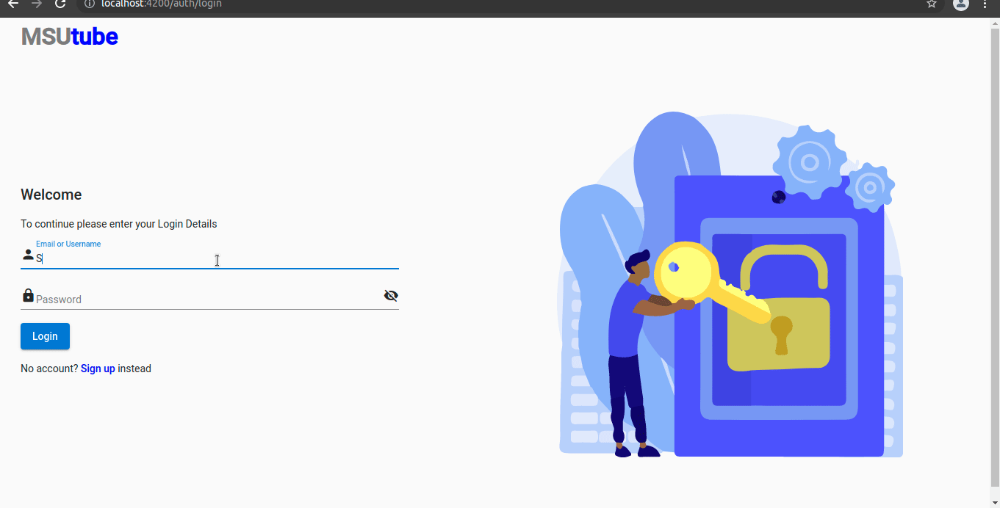
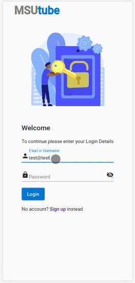

# MSUtube

A media sharing site built for MSU.
In it users can upload videos, audio and pictures. And anyone can view and/or stream them.

## Technologies

Frontend - Angular
Backend - NodeJs with Express
Database - MongoDb
FileServer - <a href="https://cloudwinterstore.co.zw">CloudWinterstore</a>

## Installing

First install node and npm then the angular-cli.
In project root run the following commands in your terminal:

<ul>
<li>To open Client side: <mark style='background-color: #999'> cd client</mark> then <mark style='background-color: #999'> ng serve --open </mark></li>

<li>To open Server side: <mark style='background-color: #999'> cd backend</mark> then <mark style='background-color: #999'> npm start </mark></li>
</ul>

The client will then run on port 4200 and the server on 5000
 
PS: Not suitable for production, only use for development

## Demo

Loging in
   

Signing up
   

Viewing video on mobile
